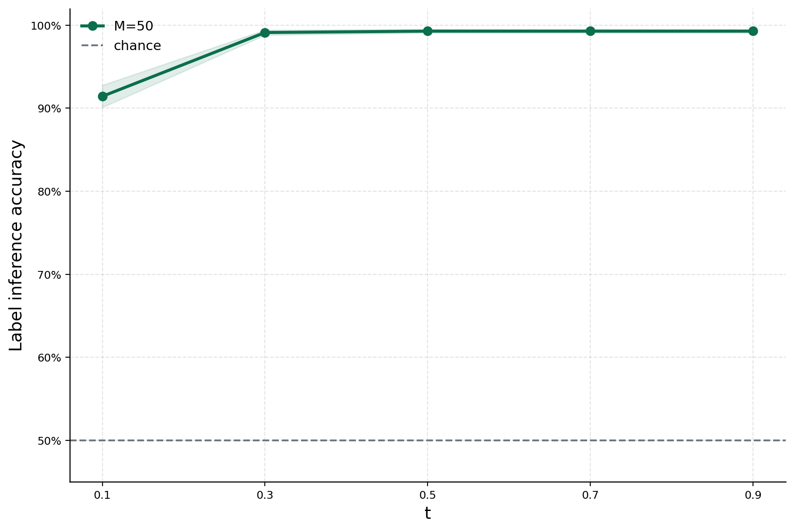
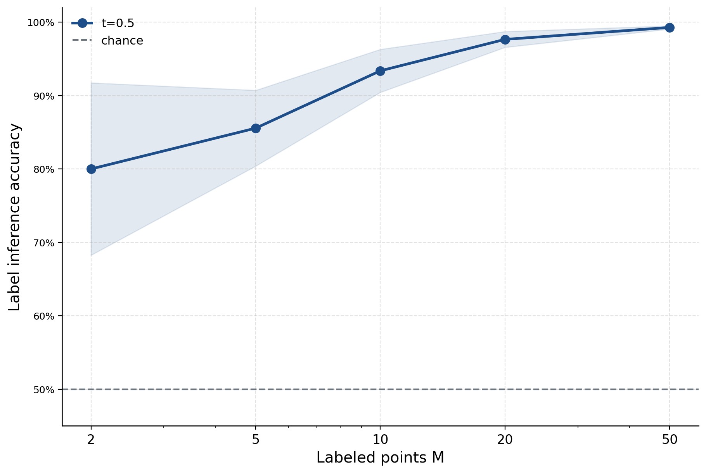
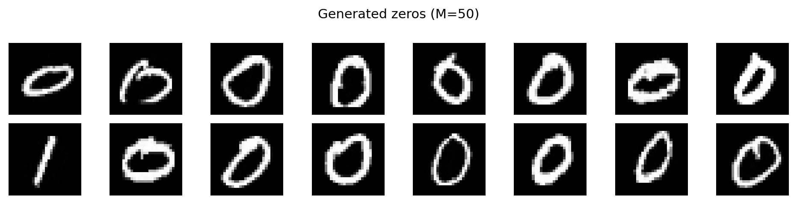
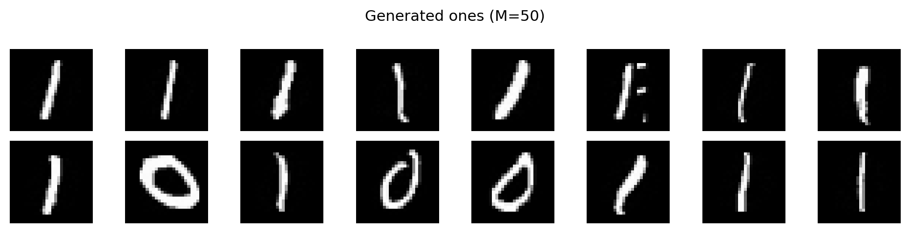
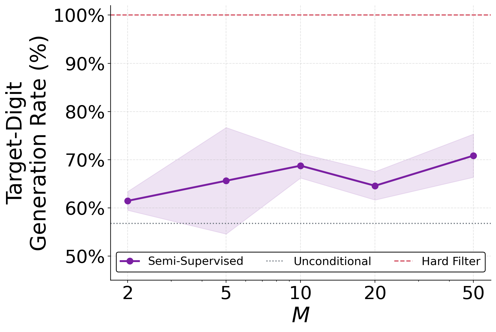

# MNIST Steering Experiment

This folder contains the digit version of the sparse-label steering experiment. It uses only MNIST zeros and ones, which makes the setup simple enough to inspect while still being closer to images than the two-moons toy problem.

The experiment asks a direct question: if only a few MNIST images are labeled, can those sparse labels steer generation toward a target digit?

The answer is shown in four steps:

1. Sparse labels are propagated through the flow kernel.
2. Label inference improves as flow time and the number of references increase.
3. The inferred labels are used to generate zeros or ones.
4. Steering quality is compared against an unconditional baseline and a hard-label oracle.

No neural network is trained here. The experiment isolates the closed-form steering mechanism before moving to the full SPFM image models.

## Core Idea

The script loads MNIST, keeps only digits `0` and `1`, and normalizes the images. A small balanced set of labeled examples is selected from the dataset. The remaining images are treated as unlabeled database points.

For an unlabeled image `x`, the method computes class posteriors from the labeled references:

```text
p(digit | x, t, sparse references)
```

Those posteriors become soft weights over the database. To generate a target digit, the sampler follows a database mean that is biased toward images with high posterior probability for that digit.

The key idea is the same as in the two-moons experiment, but MNIST makes the result more concrete: the steering signal has to work on real image vectors, not just points in two dimensions.

## Figure Story

`figures.py` generates the main MNIST diagnostics. They are meant to be read as a progression from label inference to actual generation.

### 1. Flow Time Makes Sparse Labels Useful

Output:

```text
images/mnist_accuracy_vs_t.pdf
images/mnist_accuracy_vs_t.png
```



This figure asks: at what flow time do sparse labels become informative?

The script labels a small balanced set of zeros and ones, then predicts labels for the rest of the database. Accuracy is measured against the true MNIST labels, which are used only for evaluation.

What to look for:

- Near chance performance means the sparse labels are not yet useful.
- Higher accuracy means the kernel posterior is recovering digit identity.
- The curve shows where the flow geometry starts separating zeros from ones.

This is the first sanity check: before using sparse labels to generate images, they must first recover useful class information.

### 2. More References Improve Label Inference

Output:

```text
images/mnist_accuracy_vs_m.pdf
images/mnist_accuracy_vs_m.png
```



This figure asks: how many labeled images are needed?

The experiment repeats label inference while increasing `M`, the number of labeled examples. The database stays mostly unlabeled; only the reference set changes.

What to look for:

- Very small `M` gives a weak but meaningful signal.
- Accuracy improves as more references are added.
- The curve tells the reader how label-efficient the steering mechanism is.

This is the bridge from "the posterior exists" to "the posterior can be trusted enough to steer."

### 3. Sparse Labels Steer Generated Digits

Outputs:

```text
images/mnist_generated_zeros.pdf
images/mnist_generated_zeros.png
images/mnist_generated_ones.pdf
images/mnist_generated_ones.png
```





This figure asks: does the posterior actually change what is generated?

The sampler is given a target digit. It does not use a trained classifier and it does not train a generator. It follows the database mean weighted by the inferred class posterior.

What to look for:

- The zero-targeted samples should visually resemble zeros.
- The one-targeted samples should visually resemble ones.
- Imperfections are expected; the point is that a sparse label signal can move generation toward the requested class.

This is the visual payoff: sparse labels are not only evaluated as numbers, they produce visibly different outputs.

### 4. Steering Approaches the Hard-Label Oracle

Output:

```text
images/mnist_steerability_vs_m.pdf
images/mnist_steerability_vs_m.png
```



The final figure asks: how close does soft sparse-label steering get to the best case?

The plot compares three cases:

- `Unconditional`: generate without target-digit steering.
- `Soft labels`: steer using inferred posteriors from sparse references.
- `Hard Filter`: steer using true labels as an oracle upper bound.

What to look for:

- The unconditional baseline shows how often the target digit appears without steering.
- The hard-filter line shows what is possible if the full database is labeled.
- The soft-label curve shows how quickly sparse references recover the benefit of full labels.

This is the main result of the MNIST experiment: as `M` grows, sparse-label steering moves toward the hard-label oracle while using far less supervision.

## Files

```text
mnist/
  figures.py              # Main figure-generation CLI
  run_steerability.sh     # SLURM helper for the expensive steerability sweep
  images/                 # Published figures and previews
```

The `.npz` file in `images/` is a local cache for the expensive steerability sweep. It is ignored by git.

## Run

From the repository root:

```bash
cd mnist
python figures.py --device auto --figures all
```

Generate only the cached steerability plot:

```bash
python figures.py --device auto --figures steerability
```

Useful overrides:

```bash
python figures.py \
  --data-root data/mnist \
  --output-dir images \
  --n-mnist 1000 \
  --m-values 2 5 10 20 50 \
  --n-trials 5 \
  --figures accuracy-t accuracy-m samples
```

## Run On SLURM

The steerability sweep is the slowest path. Submit it with:

```bash
cd mnist
sbatch run_steerability.sh
```

## Expected Outputs

```text
images/mnist_accuracy_vs_t.pdf
images/mnist_accuracy_vs_t.png
images/mnist_accuracy_vs_m.pdf
images/mnist_accuracy_vs_m.png
images/mnist_generated_zeros.pdf
images/mnist_generated_zeros.png
images/mnist_generated_ones.pdf
images/mnist_generated_ones.png
images/mnist_steerability_vs_m.pdf
images/mnist_steerability_vs_m.png
```

## Why This Experiment Matters

Two moons shows the mechanism in a fully visualizable space. MNIST shows that the same mechanism still works when the database points are images.

That makes this experiment the middle step in the repository:

```text
two moons -> MNIST -> SPFM image experiments
```

It keeps the method simple enough to understand, but realistic enough to show that sparse-label database steering is not only a two-dimensional artifact.
