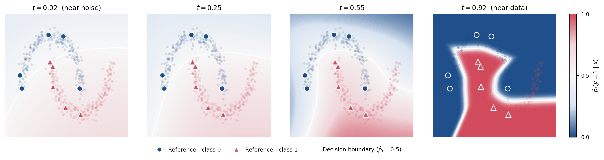
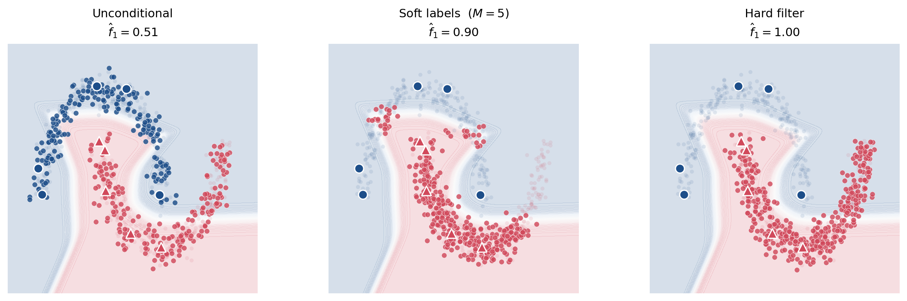
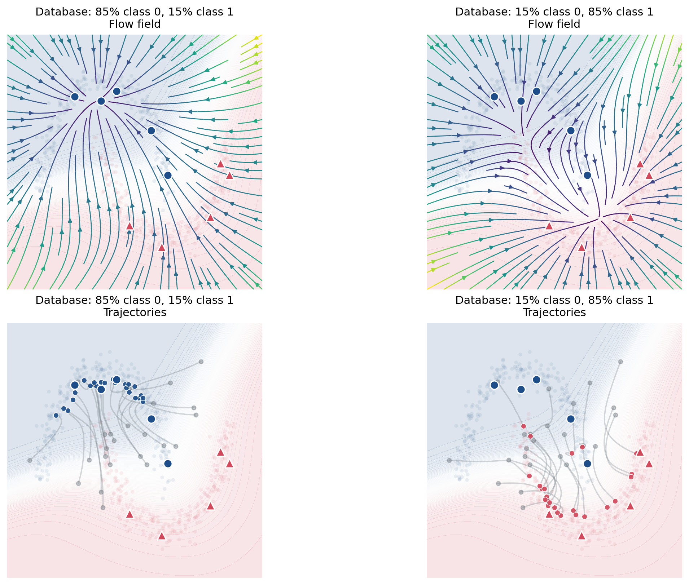
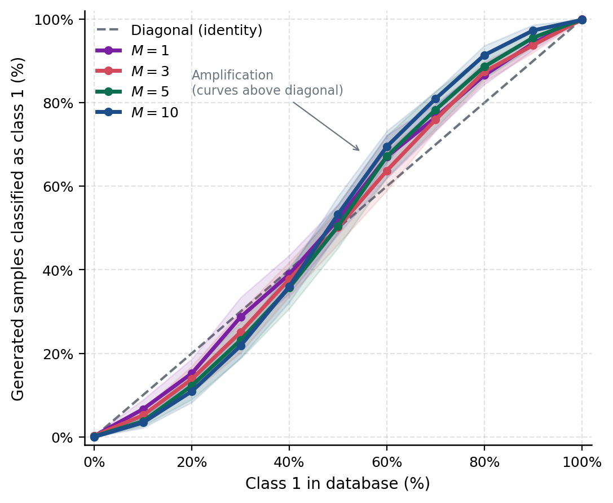
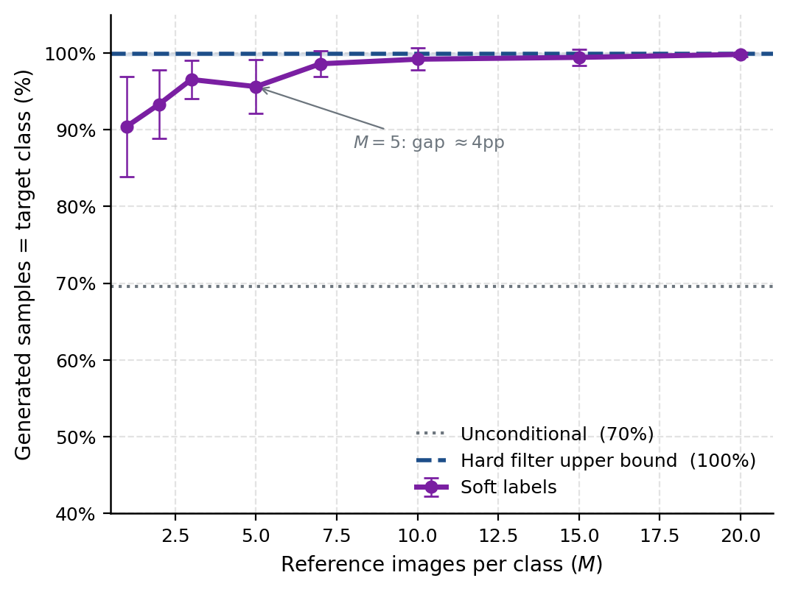

# Two-Moons Steering Experiment

This folder contains the smallest experiment in the repository: a two-dimensional version of database-steered flow matching.

The point of this experiment is not to get a benchmark number. The point is to make the mechanism visible. In image space, the model's behavior is hard to inspect because the data, the database, and the flow all live in high dimensions. With two moons, everything can be drawn: the data manifold, the sparse labels, the posterior field, the velocity field, and the generated samples.

The result should be a simple visual story:

1. Start with almost no labels.
2. Use the flow kernel to infer soft labels over the whole dataset.
3. Use those soft labels to steer generation.
4. Watch the generated distribution move when the database composition changes.
5. See that only a small number of references is enough to recover most of the steering behavior.

No neural network is trained in this experiment. That is intentional. The figures isolate the database-steering idea from model capacity, optimizer details, and architecture choices.

## Core Idea

The data are two interleaving moons. Only a few points from each moon are labeled as references. For any query point `x` and flow time `t`, the script computes a kernel-based soft posterior:

```text
p(class | x, t, sparse references)
```

Early in the flow, the posterior is uncertain because nearby points are still mixed. Later in the flow, the posterior sharpens around the geometry of the two moons. That posterior becomes a soft database filter: instead of manually selecting only one class, we can weight database samples by how likely they are to belong to the target class.

This is the important move. The experiment shows that "follow the mean" does not need hard labels everywhere. A small labeled set can induce a useful steering signal across an unlabeled database.

## Figure Story

`figures.py` generates five figures. They are meant to be read in order.

### 1. Sparse Labels Become a Posterior Field

Output:

```text
images/fig1_posteriors.pdf
images/fig1_posteriors.png
```



The first figure asks: if we label only a few points from each moon, can the method infer which class the rest of the space belongs to?

Each panel shows the class-1 posterior over the two-dimensional plane at a different flow time. The labeled references are fixed. What changes is `t`.

What to look for:

- At early times, the posterior is diffuse and cautious.
- As time increases, the posterior aligns with the moon geometry.
- The labeled points act like anchors, but the posterior spreads along the data structure instead of just forming circular blobs around the references.

This is the first "wow" point: sparse labels become a dense, geometry-aware steering field.

### 2. Soft Labels Nearly Match Hard Filtering

Output:

```text
images/fig2_conditions.pdf
images/fig2_conditions.png
```



The second figure asks: does the soft posterior actually steer generation?

It compares three generation modes:

- `Unconditional`: sample from the database without class steering.
- `Soft labels`: weight database samples by the inferred posterior.
- `Hard filter`: use the true class labels as an oracle upper bound.

What to look for:

- Unconditional generation follows the mixed database.
- Soft-label generation moves samples toward the requested moon.
- Hard filtering is the clean reference case, but soft labels should get surprisingly close without requiring labels for the full database.

This is the second key point: the inferred posterior is not just pretty to plot. It changes the generated samples in the intended direction.

### 3. The Velocity Field Shows How the Database Pulls Samples

Output:

```text
images/fig3_flow.pdf
images/fig3_flow.png
```



The third figure asks: what is the flow doing internally?

Instead of only showing final samples, this figure draws velocity fields and trajectories under different database compositions. The database is treated as the source of attraction. If the database contains more of one class, the flow bends toward that class.

What to look for:

- The vector field changes when the database composition changes.
- Trajectories do not just move randomly; they follow the local mean induced by the weighted database.
- Minority and majority compositions create visibly different paths.

This is the figure that connects the name of the repo to the mechanism: generation follows the database mean, and the mean changes when the database changes.

### 4. Database Composition Controls Output Composition

Output:

```text
images/fig4_db_composition.pdf
images/fig4_db_composition.png
```



The fourth figure asks: if we gradually change the database class balance, does the generated class balance follow?

The script sweeps the fraction of class-1 examples in the database and measures the fraction of generated samples that land on class 1.

What to look for:

- The output class balance tracks the database composition.
- The relationship is not hidden inside a black-box model; it is visible in the two-dimensional samples.
- The generated distribution can amplify the database signal, which is exactly why database composition matters.

This figure turns the qualitative story into a controlled sweep.

### 5. How Many Labels Are Needed?

Output:

```text
images/fig5_m_ablation.pdf
images/fig5_m_ablation.png
```



The final figure asks: how expensive is the sparse-label signal?

The script repeats the steering experiment while changing `M`, the number of labeled references per class. It compares the soft-label method against an unconditional baseline and the hard-filter oracle.

What to look for:

- With very few labels, the signal is noisy but already useful.
- As `M` increases, soft-label steering approaches the hard-filter behavior.
- The gap between soft labels and hard filtering shows how much is lost by not labeling the full database.

This closes the story: a small number of labels can recover most of the benefit of class-conditioned database steering.

## Files

```text
moons/
  figures.py    # Generates every two-moons figure
  images/       # Generated figures and cropped panels; ignored by git
```

The script also writes individual panel PDFs for easier paper assembly:

```text
images/fig1_posteriors_panels/
images/fig2_condition_panels/
images/fig3_flow_panels/
```

## Run

From the repository root:

```bash
cd moons
python figures.py
```

The run is deterministic. It uses `SEED = 7` and writes all outputs to `images/`.

## Expected Outputs

```text
images/fig1_posteriors.pdf
images/fig1_posteriors.png
images/fig2_conditions.pdf
images/fig2_conditions.png
images/fig3_flow.pdf
images/fig3_flow.png
images/fig4_db_composition.pdf
images/fig4_db_composition.png
images/fig5_m_ablation.pdf
images/fig5_m_ablation.png
```

## Why This Experiment Matters

The later SPFM image experiments use the same idea at scale: a database, a small amount of conditioning information, and a flow that follows a weighted mean. The two-moons experiment is the clean sanity check. It shows the mechanism without hiding it behind neural network training.

If this experiment works, the reader can see why the image experiments are plausible. If it failed, the larger experiments would be much harder to trust.
